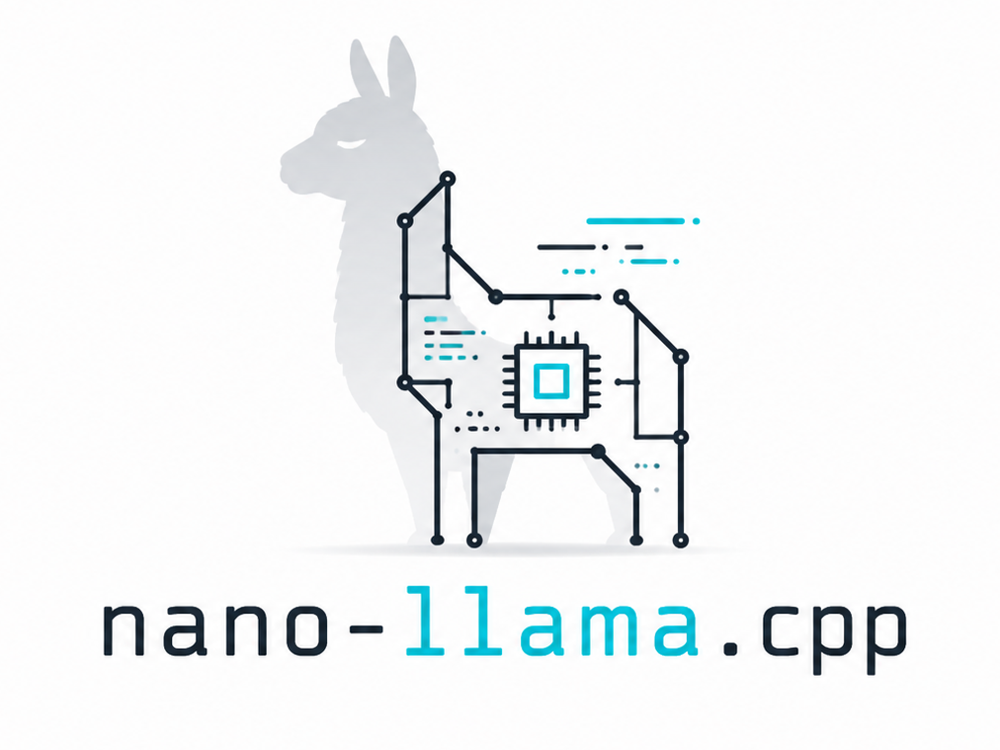

<p align="center">
  
</p>

# nano-llama.cpp

A small, readable LLM inference engine in C++/CUDA — GGUF, on CPU or a single GPU. Runs **Qwen3**
(dense) and **Qwen3.5** (a hybrid gated-DeltaNet + attention model with **vision/image input**).

The kernels come from a trimmed copy of [ggml](https://github.com/ggml-org/ggml); the models,
tokenizer, KV/recurrent cache, sampler, vision encoder, and server are written here in
**~2,700 lines** of C++.

## Key Features

- 🚀 **Fast** — on a single GPU, the same tokens/sec as the reference ggml runtime, for text *and* images.
- 🖼️ **Multimodal** — image input via a built-in ViT vision encoder, on the CLI (`--image`) and server.
- 🛠️ **Developer-friendly** — a small, readable codebase (~2,700 lines of C++); add your own models and operators following the `AGENTS.md` guide.
- 🔀 **Continuous-batching server** — OpenAI-compatible `/v1/chat/completions` + `/completion` with streaming; multiple in-flight requests (text or image) batched into one forward pass.
- 🖥️ **Backend support** — the same code runs on CPU or CUDA; the GPU path uses flash-attention and CUDA-graph replay.
- 🪶 **No heavy dependencies** — a vendored ggml plus two small libraries (HTTP + JSON) for the server.

## Build

Requires CMake ≥ 3.18 and a C++17 compiler. For the GPU build, the CUDA toolkit.

```bash
# GPU (CUDA is on by default)
cmake -B build
cmake --build build -j

# CPU only
cmake -B build -DNANO_CUDA=OFF
cmake --build build -j
```

Binaries land in `build/`: `nano-example`, `nano-bench`, `nano-server`.

> The build uses the `nvcc` on your `PATH`. To force a specific toolkit (or target arch), pass
> `-DCMAKE_CUDA_COMPILER=/usr/local/cuda-12.4/bin/nvcc -DCMAKE_CUDA_ARCHITECTURES=86`.

## Get a model

```bash
mkdir -p models
# language model + vision projector (mmproj is only needed for image input)
curl -L https://huggingface.co/unsloth/Qwen3.5-4B-GGUF/resolve/main/Qwen3.5-4B-Q4_K_M.gguf -o models/Qwen3.5-4B-Q4_K_M.gguf \
        https://huggingface.co/unsloth/Qwen3.5-4B-GGUF/resolve/main/mmproj-F16.gguf        -o models/mmproj-F16.gguf
```

## Quick Start

### CLI

```bash
# text, GPU, greedy
./build/nano-example -m models/Qwen3.5-4B-Q4_K_M.gguf -ngl 99 --temp 0 -n 128 "The capital of France is"

# chat turn (ChatML), reasoning disabled
./build/nano-example -m models/Qwen3.5-4B-Q4_K_M.gguf -ngl 99 --chat --no-think "Explain RoPE in one sentence."

# image input — pass the vision projector and an image
./build/nano-example -m models/Qwen3.5-4B-Q4_K_M.gguf --mmproj models/mmproj-F16.gguf \
    --image photo.jpg -ngl 99 "What is the headline?"

# CPU
./build/nano-example -m models/Qwen3.5-4B-Q4_K_M.gguf -ngl 0 -t 16 "Once upon a time,"
```

Flags: `-ngl` (>0 = whole model on GPU, 0 = CPU), `-t` threads, `-c` context, `-n` max tokens,
`--temp/--top-k/--top-p/--min-p/--seed`, `--chat`, `--no-think`, `--mmproj` (vision projector),
`--image` (image file).

### Benchmark

```bash
./build/nano-bench -m models/Qwen3.5-4B-Q4_K_M.gguf -ngl 99 -pp 512 -tg 128       # single stream
./build/nano-bench -m models/Qwen3.5-4B-Q4_K_M.gguf -ngl 99 -pp 8 -tg 512 -np 128 # batched throughput
```

### Server

```bash
./build/nano-server -m models/Qwen3.5-4B-Q4_K_M.gguf --mmproj models/mmproj-F16.gguf \
    -ngl 99 -np 8 --port 8080
```

```bash
# text
curl http://127.0.0.1:8080/v1/chat/completions -H 'Content-Type: application/json' -d '{
  "messages": [{"role": "user", "content": "Name three primary colors."}],
  "max_tokens": 64
}'

# image — sent as a base64 data URI (here, a sample image fetched from the web)
IMG=$(curl -sL https://huggingface.co/datasets/huggingface/documentation-images/resolve/main/pipeline-cat-chonk.jpeg | base64 -w0)
curl http://127.0.0.1:8080/v1/chat/completions -H 'Content-Type: application/json' -d '{
  "messages": [{"role": "user", "content": [
    {"type": "text", "text": "Describe this image."},
    {"type": "image_url", "image_url": {"url": "data:image/jpeg;base64,'"$IMG"'"}}
  ]}],
  "max_tokens": 64
}'
```

Endpoints: `/health`, `/v1/models`, `/completion`, `/v1/chat/completions` — with streaming,
`enable_thinking`, and base64 `image_url` (when `--mmproj` is set). `-np` = concurrent slots.

## Performance

Qwen3.5-4B-Q4_K_M. **GPU:** RTX 3090. **CPU:** AMD Ryzen Threadripper PRO 3955WX (16 cores, 16 threads).
Single-stream tokens/sec and peak memory:

| | prompt (pp512) | generate (tg128) | peak memory |
|---|---:|---:|---:|
| nano-llama.cpp (GPU) | 6017 | 168 | 3.0 GiB VRAM |
| llama.cpp (GPU)      | 5944 | 175 | 3.4 GiB VRAM |
| nano-llama.cpp (CPU) |   98 | 8.8 | 3.2 GiB RSS |
| llama.cpp (CPU)      |  116 | 9.0 | 4.1 GiB RSS |

**Continuous batching:** each sequence is its own attention stream, so generation throughput rises
with concurrency, peaking at **~1,120 tok/s** aggregate on one 3090.

## License

MIT (see [LICENSE](LICENSE)). Vendored third-party code keeps its own license, all MIT:

- **ggml** — © The ggml authors ([ggml/LICENSE](ggml/LICENSE))
- **cpp-httplib** — © Yuji Hirose ([vendor/cpp-httplib/LICENSE](vendor/cpp-httplib/LICENSE))
- **nlohmann/json** — © Niels Lohmann ([vendor/nlohmann/LICENSE.MIT](vendor/nlohmann/LICENSE.MIT))
- **stb_image** — © Sean Barrett, public domain ([vendor/stb_image.h](vendor/stb_image.h))
